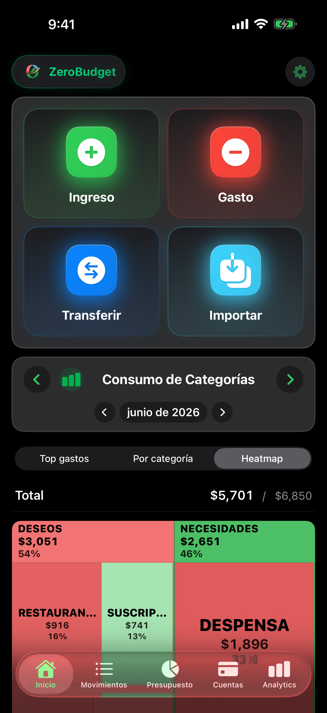
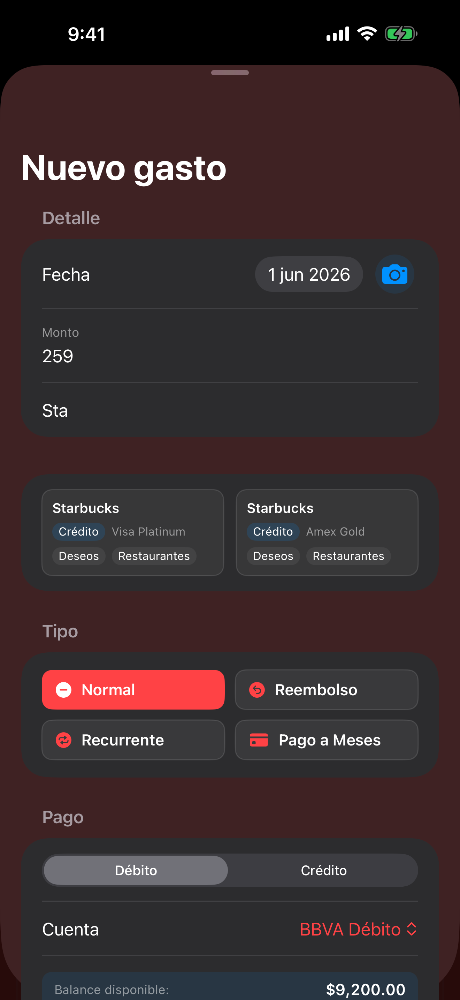
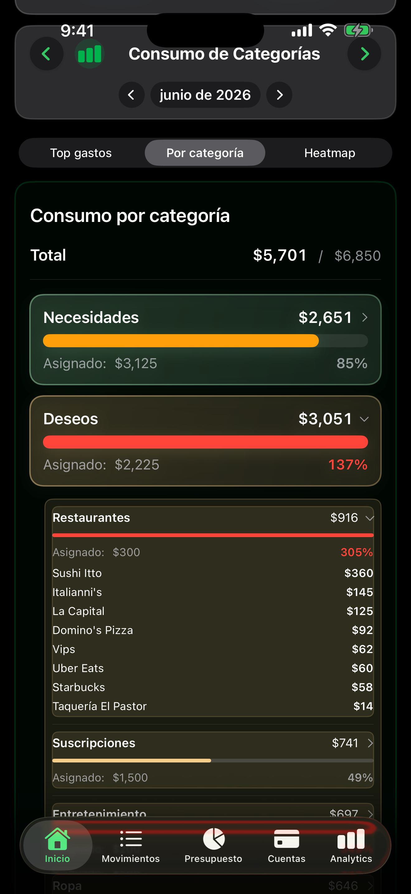
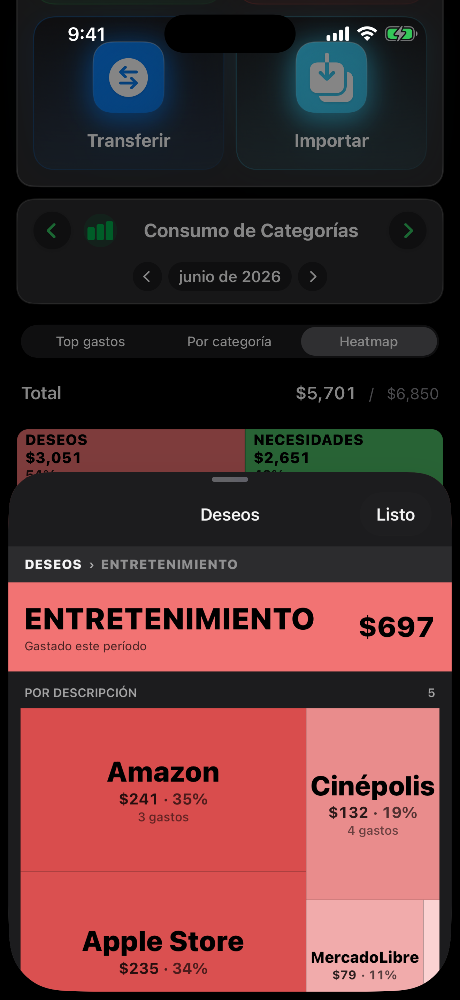
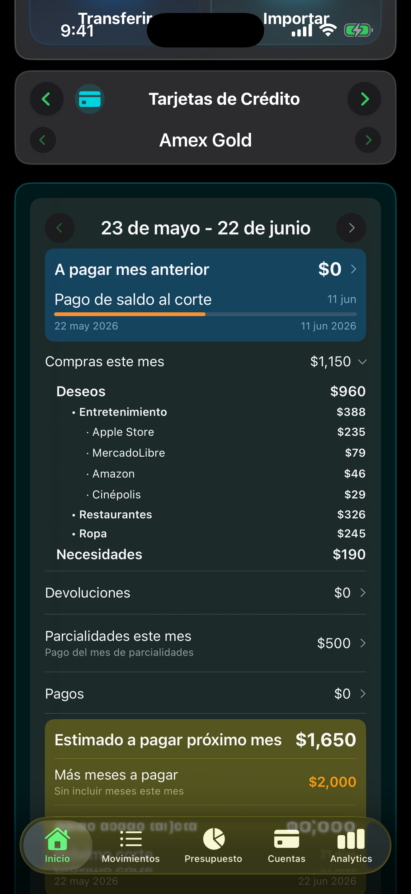
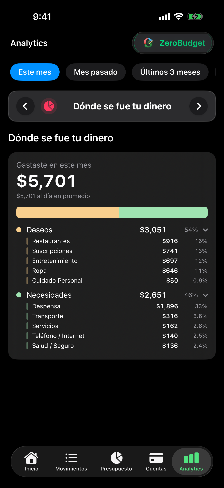

# i18n (EN + FR) Implementation Plan

> **For Claude:** REQUIRED SUB-SKILL: Use superpowers:executing-plans to implement this plan task-by-task.

**Goal:** Add English and French versions of araniosoft.com using static subdirectories with browser-language auto-redirect and adapted content for global markets.

**Architecture:** Static HTML subdirectories `/en/` and `/fr/`. Existing Spanish pages get a tiny redirect snippet + hreflang tags. New EN/FR pages are full copies with translated and adapted content. No build step — edit HTML directly.

**Tech Stack:** HTML5, CSS3, vanilla JS (one-liner redirect only). Git deploy via Cloudflare Pages.

---

### Task 1: Add redirect + hreflang to ES root pages

**Files:**
- Modify: `index.html`
- Modify: `zeroBudget/index.html`

**Step 1: Add redirect snippet to `index.html`**

In `index.html`, find:
```html
    <meta charset="UTF-8">
    <meta name="viewport" content="width=device-width, initial-scale=1.0">
    <title>Aranio Soft
```
Replace with:
```html
    <meta charset="UTF-8">
    <script>(function(){var l=(navigator.language||'').toLowerCase().split('-')[0];if(l==='en')location.replace('/en/');else if(l==='fr')location.replace('/fr/');})()</script>
    <meta name="viewport" content="width=device-width, initial-scale=1.0">
    <title>Aranio Soft
```

**Step 2: Add hreflang tags to `index.html`**

Find:
```html
    <link rel="canonical" href="https://araniosoft.com/">
```
Replace with:
```html
    <link rel="canonical" href="https://araniosoft.com/">
    <link rel="alternate" hreflang="es"       href="https://araniosoft.com/">
    <link rel="alternate" hreflang="en"       href="https://araniosoft.com/en/">
    <link rel="alternate" hreflang="fr"       href="https://araniosoft.com/fr/">
    <link rel="alternate" hreflang="x-default" href="https://araniosoft.com/">
```

**Step 3: Add redirect snippet to `zeroBudget/index.html`**

In `zeroBudget/index.html`, find:
```html
    <meta charset="UTF-8">
    <meta name="viewport" content="width=device-width, initial-scale=1.0">
    <title>ZeroBudget
```
Replace with:
```html
    <meta charset="UTF-8">
    <script>(function(){var l=(navigator.language||'').toLowerCase().split('-')[0];if(l==='en')location.replace('/en/zeroBudget/');else if(l==='fr')location.replace('/fr/zeroBudget/');})()</script>
    <meta name="viewport" content="width=device-width, initial-scale=1.0">
    <title>ZeroBudget
```

**Step 4: Add hreflang tags to `zeroBudget/index.html`**

Find:
```html
    <link rel="canonical" href="https://araniosoft.com/zeroBudget/">
```
Replace with:
```html
    <link rel="canonical" href="https://araniosoft.com/zeroBudget/">
    <link rel="alternate" hreflang="es"       href="https://araniosoft.com/zeroBudget/">
    <link rel="alternate" hreflang="en"       href="https://araniosoft.com/en/zeroBudget/">
    <link rel="alternate" hreflang="fr"       href="https://araniosoft.com/fr/zeroBudget/">
    <link rel="alternate" hreflang="x-default" href="https://araniosoft.com/zeroBudget/">
```

**Step 5: Validate both ES files**

```bash
python3 -c "
from html.parser import HTMLParser
class V(HTMLParser): pass
for f in ['index.html','zeroBudget/index.html']:
    V().feed(open(f'/Users/rauldominguezu/Developer/araniosoft-website/{f}').read())
    print(f'✓ {f} valid')
"
```
Expected: `✓ index.html valid` and `✓ zeroBudget/index.html valid`

**Step 6: Commit**

```bash
cd /Users/rauldominguezu/Developer/araniosoft-website
git add index.html zeroBudget/index.html
git commit -m "feat: add language auto-redirect and hreflang to ES pages"
```

---

### Task 2: Create /en/ homepage

**Files:**
- Create: `en/index.html`

**Step 1: Create the `en/` directory and file**

```bash
mkdir -p /Users/rauldominguezu/Developer/araniosoft-website/en
```

**Step 2: Create `en/index.html`**

Create the file with this exact content:

```html
<!DOCTYPE html>
<html lang="en">
<head>
    <meta charset="UTF-8">
    <meta name="viewport" content="width=device-width, initial-scale=1.0">
    <title>Aranio Soft — iOS Apps that respect your privacy</title>
    <meta name="description" content="Aranio Soft builds private, 100% offline iOS apps. ZeroBudget: personal finance management with no servers or user accounts.">
    <link rel="canonical" href="https://araniosoft.com/en/">
    <link rel="alternate" hreflang="es"        href="https://araniosoft.com/">
    <link rel="alternate" hreflang="en"        href="https://araniosoft.com/en/">
    <link rel="alternate" hreflang="fr"        href="https://araniosoft.com/fr/">
    <link rel="alternate" hreflang="x-default" href="https://araniosoft.com/">

    <!-- Open Graph -->
    <meta property="og:type"        content="website">
    <meta property="og:url"         content="https://araniosoft.com/en/">
    <meta property="og:title"       content="Aranio Soft — iOS Apps that respect your privacy">
    <meta property="og:description" content="Aranio Soft builds private, 100% offline iOS apps. ZeroBudget: personal finance with no servers or accounts.">
    <meta property="og:image"       content="https://araniosoft.com/logo.png">
    <meta property="og:locale"      content="en_US">

    <!-- Twitter Card -->
    <meta name="twitter:card"        content="summary">
    <meta name="twitter:title"       content="Aranio Soft — Private iOS Apps">
    <meta name="twitter:description" content="ZeroBudget: 100% offline personal finance for iPhone.">
    <meta name="twitter:image"       content="https://araniosoft.com/logo.png">

    <!-- JSON-LD Organization -->
    <script type="application/ld+json">
    {
      "@context": "https://schema.org",
      "@type": "Organization",
      "name": "Aranio Soft",
      "url": "https://araniosoft.com",
      "logo": "https://araniosoft.com/logo.png",
      "email": "soporte@araniosoft.com",
      "description": "iOS app development company focused on privacy and offline-first apps."
    }
    </script>
    <style>
        :root {
            --bg: #FAFAFA;
            --card: #FFFFFF;
            --text: #1A1A1A;
            --muted: #6B7280;
            --accent: #10B981;
            --border: #E5E7EB;
        }
        @media (prefers-color-scheme: dark) {
            :root {
                --bg: #111111;
                --card: #1C1C1E;
                --text: #F5F5F5;
                --muted: #9CA3AF;
                --accent: #34D399;
                --border: #2D2D2D;
            }
        }
        * { margin: 0; padding: 0; box-sizing: border-box; }
        body {
            font-family: -apple-system, BlinkMacSystemFont, "SF Pro Text", "Helvetica Neue", sans-serif;
            background: var(--bg);
            color: var(--text);
            line-height: 1.7;
            min-height: 100vh;
            display: flex;
            align-items: center;
            justify-content: center;
            padding: 2rem 1rem;
        }
        .container { max-width: 600px; text-align: center; }
        .brand {
            font-size: 2.5rem;
            font-weight: 800;
            margin-bottom: 0.5rem;
            background: linear-gradient(135deg, var(--accent), #059669);
            -webkit-background-clip: text;
            -webkit-text-fill-color: transparent;
        }
        .tagline { font-size: 1.1rem; color: var(--muted); margin-bottom: 3rem; }
        .app-card {
            background: var(--card);
            border: 1px solid var(--border);
            border-radius: 16px;
            padding: 2rem;
            text-decoration: none;
            color: var(--text);
            display: block;
            transition: transform 0.2s, box-shadow 0.2s;
        }
        .app-card:hover { transform: translateY(-4px); box-shadow: 0 12px 40px rgba(0,0,0,0.1); }
        .app-icon { margin-bottom: 1rem; }
        .app-icon img { width: 100px; height: 100px; border-radius: 22px; }
        .app-name { font-size: 1.5rem; font-weight: 700; margin-bottom: 0.5rem; }
        .app-desc { color: var(--muted); font-size: 0.95rem; }
        .badge-row { display: flex; gap: 0.5rem; justify-content: center; margin-top: 1rem; }
        .badge { font-size: 0.7rem; font-weight: 600; padding: 3px 10px; border-radius: 20px; background: var(--accent); color: white; }
        .footer { margin-top: 3rem; color: var(--muted); font-size: 0.8rem; }
        .footer a { color: var(--accent); text-decoration: none; }
    </style>
</head>
<body>
    <div class="container">
        <div class="brand">Aranio Soft</div>
        <p class="tagline">Apps that respect your privacy</p>

        <a href="zeroBudget/" class="app-card">
            <div class="app-icon"></div>
            <div class="app-name">ZeroBudget</div>
            <p class="app-desc">Simple and private personal finance. Budgets, savings goals, multi-account — all on your device.</p>
            <div class="badge-row">
                <span class="badge">iOS</span>
                <span class="badge">100% Offline</span>
                <span class="badge">Free</span>
            </div>
        </a>

        <div class="footer">
            <p>&copy; 2026 Aranio Soft</p>
            <p style="margin-top: 0.5rem;"><a href="mailto:soporte@araniosoft.com">soporte@araniosoft.com</a></p>
        </div>
    </div>
</body>
</html>
```

**Step 3: Validate**

```bash
python3 -c "
from html.parser import HTMLParser
class V(HTMLParser): pass
V().feed(open('/Users/rauldominguezu/Developer/araniosoft-website/en/index.html').read())
print('✓ en/index.html valid')
"
```
Expected: `✓ en/index.html valid`

**Step 4: Commit**

```bash
cd /Users/rauldominguezu/Developer/araniosoft-website
git add en/index.html
git commit -m "feat: add English homepage (/en/)"
```

---

### Task 3: Create /en/zeroBudget/ page

**Files:**
- Create: `en/zeroBudget/index.html`

**Step 1: Create directory**

```bash
mkdir -p /Users/rauldominguezu/Developer/araniosoft-website/en/zeroBudget
```

**Step 2: Create `en/zeroBudget/index.html`**

```html
<!DOCTYPE html>
<html lang="en">
<head>
    <meta charset="UTF-8">
    <meta name="viewport" content="width=device-width, initial-scale=1.0">
    <title>ZeroBudget — Private Personal Finance for iPhone</title>
    <meta name="description" content="ZeroBudget: manage your personal finances on iPhone without servers or accounts. Budgets, savings goals, multi-account, analytics. 100% offline and free.">
    <link rel="canonical" href="https://araniosoft.com/en/zeroBudget/">
    <link rel="alternate" hreflang="es"        href="https://araniosoft.com/zeroBudget/">
    <link rel="alternate" hreflang="en"        href="https://araniosoft.com/en/zeroBudget/">
    <link rel="alternate" hreflang="fr"        href="https://araniosoft.com/fr/zeroBudget/">
    <link rel="alternate" hreflang="x-default" href="https://araniosoft.com/zeroBudget/">

    <!-- Open Graph -->
    <meta property="og:type"        content="website">
    <meta property="og:url"         content="https://araniosoft.com/en/zeroBudget/">
    <meta property="og:title"       content="ZeroBudget — Private Personal Finance for iPhone">
    <meta property="og:description" content="Manage your finances without servers or accounts. 100% offline, budgets, savings goals and analytics on your iPhone.">
    <meta property="og:image"       content="https://araniosoft.com/zeroBudget/screenshots/dashboard.png">
    <meta property="og:locale"      content="en_US">

    <!-- Twitter Card -->
    <meta name="twitter:card"        content="summary_large_image">
    <meta name="twitter:title"       content="ZeroBudget — Personal Finance for iPhone">
    <meta name="twitter:description" content="100% offline. No servers. No accounts. Your finances, only on your iPhone.">
    <meta name="twitter:image"       content="https://araniosoft.com/zeroBudget/screenshots/dashboard.png">

    <!-- JSON-LD SoftwareApplication -->
    <script type="application/ld+json">
    {
      "@context": "https://schema.org",
      "@type": "SoftwareApplication",
      "name": "ZeroBudget",
      "operatingSystem": "iOS",
      "applicationCategory": "FinanceApplication",
      "offers": { "@type": "Offer", "price": "0", "priceCurrency": "USD" },
      "description": "Personal finance app for iPhone. 100% offline, no servers or user accounts. Budgets, savings goals, multi-account and analytics.",
      "author": { "@type": "Organization", "name": "Aranio Soft", "url": "https://araniosoft.com" }
    }
    </script>
    <style>
        :root {
            --bg: #FAFAFA; --card: #FFFFFF; --text: #1A1A1A;
            --muted: #6B7280; --accent: #10B981; --accent-dark: #059669; --border: #E5E7EB;
        }
        @media (prefers-color-scheme: dark) {
            :root {
                --bg: #111111; --card: #1C1C1E; --text: #F5F5F5;
                --muted: #9CA3AF; --accent: #34D399; --accent-dark: #10B981; --border: #2D2D2D;
            }
        }
        * { margin: 0; padding: 0; box-sizing: border-box; }
        body { font-family: -apple-system, BlinkMacSystemFont, "SF Pro Text", "Helvetica Neue", sans-serif; background: var(--bg); color: var(--text); line-height: 1.7; }
        .hero { text-align: center; padding: 4rem 1.5rem 3rem; }
        .hero-icon { margin-bottom: 1rem; }
        .hero-icon img { width: 120px; height: 120px; border-radius: 26px; }
        .hero h1 { font-size: 2.5rem; font-weight: 800; background: linear-gradient(135deg, var(--accent), var(--accent-dark)); -webkit-background-clip: text; -webkit-text-fill-color: transparent; margin-bottom: 0.75rem; }
        .hero p { font-size: 1.15rem; color: var(--muted); max-width: 500px; margin: 0 auto 2rem; }
        .badge-row { display: flex; gap: 0.5rem; justify-content: center; flex-wrap: wrap; margin-bottom: 2rem; }
        .badge { font-size: 0.75rem; font-weight: 600; padding: 4px 12px; border-radius: 20px; background: var(--accent); color: white; }
        .features { max-width: 800px; margin: 0 auto; padding: 0 1.5rem 3rem; display: grid; grid-template-columns: repeat(auto-fit, minmax(220px, 1fr)); gap: 1.25rem; }
        .feature { background: var(--card); border: 1px solid var(--border); border-radius: 14px; padding: 1.5rem; text-align: center; }
        .feature-icon { font-size: 2rem; margin-bottom: 0.75rem; }
        .feature h3 { font-size: 1rem; font-weight: 600; margin-bottom: 0.4rem; }
        .feature p { font-size: 0.85rem; color: var(--muted); }
        .privacy-callout { max-width: 600px; margin: 0 auto 3rem; padding: 0 1.5rem; }
        .privacy-callout .card { background: var(--card); border: 2px solid var(--accent); border-radius: 14px; padding: 2rem; text-align: center; }
        .privacy-callout h2 { font-size: 1.3rem; font-weight: 700; margin-bottom: 0.5rem; }
        .privacy-callout p { color: var(--muted); font-size: 0.9rem; }
        footer { text-align: center; padding: 2rem 1.5rem; border-top: 1px solid var(--border); color: var(--muted); font-size: 0.8rem; }
        footer a { color: var(--accent); text-decoration: none; }
        footer a:hover { text-decoration: underline; }
        .footer-links { display: flex; gap: 1.5rem; justify-content: center; margin-bottom: 1rem; }
        .coming-soon { font-size: 0.85rem; color: var(--muted); margin-bottom: 0.75rem; letter-spacing: 0.05em; text-transform: uppercase; font-weight: 600; }
        .notify-btn { display: inline-block; background: var(--accent); color: white; padding: 0.75rem 1.75rem; border-radius: 50px; font-weight: 700; font-size: 0.95rem; text-decoration: none; margin-bottom: 2rem; transition: opacity 0.2s; }
        .notify-btn:hover { opacity: 0.85; }
        .gallery-section { max-width: 800px; margin: 0 auto 3rem; padding: 0 1.5rem; text-align: center; }
        .gallery-section h2 { font-size: 1.3rem; font-weight: 700; margin-bottom: 1.5rem; }
        .gallery { display: flex; gap: 1rem; overflow-x: auto; scroll-snap-type: x mandatory; -webkit-overflow-scrolling: touch; padding-bottom: 0.5rem; justify-content: center; }
        .gallery img { width: 200px; flex-shrink: 0; border-radius: 28px; box-shadow: 0 8px 30px rgba(0,0,0,0.15); scroll-snap-align: center; }
        @media (max-width: 600px) { .gallery { justify-content: flex-start; } .gallery img { width: 160px; } }
    </style>
</head>
<body>
    <section class="hero">
        <div class="hero-icon"></div>
        <h1>ZeroBudget</h1>
        <p>Your personal finances, organized and private. No servers, no accounts, no complications.</p>
        <div class="badge-row">
            <span class="badge">🔒 100% Local</span>
            <span class="badge">📱 iOS</span>
            <span class="badge">🌙 Dark Mode</span>
        </div>
        <p class="coming-soon">Coming soon to the App Store</p>
        <a href="mailto:soporte@araniosoft.com?subject=Notify%20me%20about%20ZeroBudget" class="notify-btn">
            🔔 Notify me when available
        </a>
    </section>

    <section class="features">
        <div class="feature">
            <div class="feature-icon">📊</div>
            <h3>Smart Budget</h3>
            <p>Step-by-step assistant to distribute your income using the 50/20/20/10 rule.</p>
        </div>
        <div class="feature">
            <div class="feature-icon">🏦</div>
            <h3>Multi-Account</h3>
            <p>Manage cash, debit, credit and savings accounts in one place.</p>
        </div>
        <div class="feature">
            <div class="feature-icon">🎯</div>
            <h3>Savings Goals</h3>
            <p>Set goals with dedicated accounts and track your progress automatically.</p>
        </div>
        <div class="feature">
            <div class="feature-icon">📈</div>
            <h3>Analytics</h3>
            <p>Visualize your habits with trend charts, categories and spending patterns.</p>
        </div>
        <div class="feature">
            <div class="feature-icon">📸</div>
            <h3>Receipt Scanning</h3>
            <p>Take a photo of your receipts and OCR extracts the data automatically.</p>
        </div>
        <div class="feature">
            <div class="feature-icon">🏧</div>
            <h3>Bank Import</h3>
            <p>Import CSV and Excel files from any bank worldwide.</p>
        </div>
        <div class="feature">
            <div class="feature-icon">🗣️</div>
            <h3>Siri</h3>
            <p>"Hey Siri, add $50 expense at Walmart." Log transactions with your voice.</p>
        </div>
        <div class="feature">
            <div class="feature-icon">🔐</div>
            <h3>Face ID</h3>
            <p>Protect your data with Face ID, Touch ID or passcode.</p>
        </div>
    </section>

    <section class="gallery-section">
        <h2>See how it works</h2>
        <div class="gallery">
            
            
            
            
            
            
        </div>
    </section>

    <section class="privacy-callout">
        <div class="card">
            <h2>🛡️ Your Privacy First</h2>
            <p>ZeroBudget has no servers, collects no data, has no user accounts. All your financial information lives exclusively on your iPhone.</p>
        </div>
    </section>

    <footer>
        <div class="footer-links">
            <a href="../../zeroBudget/privacy.html">Privacy Policy</a>
            <a href="../../zeroBudget/terms.html">Terms of Service</a>
            <a href="mailto:soporte@araniosoft.com">Contact</a>
        </div>
        <p>&copy; 2026 <a href="../">Aranio Soft</a>. All rights reserved.</p>
    </footer>
</body>
</html>
```

**Step 3: Validate**

```bash
python3 -c "
from html.parser import HTMLParser
class V(HTMLParser): pass
V().feed(open('/Users/rauldominguezu/Developer/araniosoft-website/en/zeroBudget/index.html').read())
print('✓ en/zeroBudget/index.html valid')
"
```

**Step 4: Commit**

```bash
cd /Users/rauldominguezu/Developer/araniosoft-website
git add en/zeroBudget/index.html
git commit -m "feat: add English ZeroBudget product page (/en/zeroBudget/)"
```

---

### Task 4: Create /fr/ homepage

**Files:**
- Create: `fr/index.html`

**Step 1: Create directory**

```bash
mkdir -p /Users/rauldominguezu/Developer/araniosoft-website/fr
```

**Step 2: Create `fr/index.html`**

```html
<!DOCTYPE html>
<html lang="fr">
<head>
    <meta charset="UTF-8">
    <meta name="viewport" content="width=device-width, initial-scale=1.0">
    <title>Aranio Soft — Applications iOS qui respectent votre vie privée</title>
    <meta name="description" content="Aranio Soft crée des apps iOS privées et 100% hors ligne. ZeroBudget : gestion des finances personnelles sans serveurs ni comptes utilisateur.">
    <link rel="canonical" href="https://araniosoft.com/fr/">
    <link rel="alternate" hreflang="es"        href="https://araniosoft.com/">
    <link rel="alternate" hreflang="en"        href="https://araniosoft.com/en/">
    <link rel="alternate" hreflang="fr"        href="https://araniosoft.com/fr/">
    <link rel="alternate" hreflang="x-default" href="https://araniosoft.com/">

    <!-- Open Graph -->
    <meta property="og:type"        content="website">
    <meta property="og:url"         content="https://araniosoft.com/fr/">
    <meta property="og:title"       content="Aranio Soft — Applications iOS qui respectent votre vie privée">
    <meta property="og:description" content="Aranio Soft crée des apps iOS privées et 100% hors ligne. ZeroBudget : finances personnelles sans serveurs ni comptes.">
    <meta property="og:image"       content="https://araniosoft.com/logo.png">
    <meta property="og:locale"      content="fr_FR">

    <!-- Twitter Card -->
    <meta name="twitter:card"        content="summary">
    <meta name="twitter:title"       content="Aranio Soft — Apps iOS privées">
    <meta name="twitter:description" content="ZeroBudget : finances personnelles 100% hors ligne pour iPhone.">
    <meta name="twitter:image"       content="https://araniosoft.com/logo.png">

    <!-- JSON-LD Organization -->
    <script type="application/ld+json">
    {
      "@context": "https://schema.org",
      "@type": "Organization",
      "name": "Aranio Soft",
      "url": "https://araniosoft.com",
      "logo": "https://araniosoft.com/logo.png",
      "email": "soporte@araniosoft.com",
      "description": "Entreprise de développement d'apps iOS axée sur la confidentialité et le mode hors ligne."
    }
    </script>
    <style>
        :root {
            --bg: #FAFAFA; --card: #FFFFFF; --text: #1A1A1A;
            --muted: #6B7280; --accent: #10B981; --border: #E5E7EB;
        }
        @media (prefers-color-scheme: dark) {
            :root {
                --bg: #111111; --card: #1C1C1E; --text: #F5F5F5;
                --muted: #9CA3AF; --accent: #34D399; --border: #2D2D2D;
            }
        }
        * { margin: 0; padding: 0; box-sizing: border-box; }
        body { font-family: -apple-system, BlinkMacSystemFont, "SF Pro Text", "Helvetica Neue", sans-serif; background: var(--bg); color: var(--text); line-height: 1.7; min-height: 100vh; display: flex; align-items: center; justify-content: center; padding: 2rem 1rem; }
        .container { max-width: 600px; text-align: center; }
        .brand { font-size: 2.5rem; font-weight: 800; margin-bottom: 0.5rem; background: linear-gradient(135deg, var(--accent), #059669); -webkit-background-clip: text; -webkit-text-fill-color: transparent; }
        .tagline { font-size: 1.1rem; color: var(--muted); margin-bottom: 3rem; }
        .app-card { background: var(--card); border: 1px solid var(--border); border-radius: 16px; padding: 2rem; text-decoration: none; color: var(--text); display: block; transition: transform 0.2s, box-shadow 0.2s; }
        .app-card:hover { transform: translateY(-4px); box-shadow: 0 12px 40px rgba(0,0,0,0.1); }
        .app-icon { margin-bottom: 1rem; }
        .app-icon img { width: 100px; height: 100px; border-radius: 22px; }
        .app-name { font-size: 1.5rem; font-weight: 700; margin-bottom: 0.5rem; }
        .app-desc { color: var(--muted); font-size: 0.95rem; }
        .badge-row { display: flex; gap: 0.5rem; justify-content: center; margin-top: 1rem; }
        .badge { font-size: 0.7rem; font-weight: 600; padding: 3px 10px; border-radius: 20px; background: var(--accent); color: white; }
        .footer { margin-top: 3rem; color: var(--muted); font-size: 0.8rem; }
        .footer a { color: var(--accent); text-decoration: none; }
    </style>
</head>
<body>
    <div class="container">
        <div class="brand">Aranio Soft</div>
        <p class="tagline">Des apps qui respectent votre vie privée</p>

        <a href="zeroBudget/" class="app-card">
            <div class="app-icon"></div>
            <div class="app-name">ZeroBudget</div>
            <p class="app-desc">Finances personnelles simples et privées. Budgets, objectifs d'épargne, multi-comptes — tout sur votre appareil.</p>
            <div class="badge-row">
                <span class="badge">iOS</span>
                <span class="badge">100% Hors ligne</span>
                <span class="badge">Gratuit</span>
            </div>
        </a>

        <div class="footer">
            <p>&copy; 2026 Aranio Soft</p>
            <p style="margin-top: 0.5rem;"><a href="mailto:soporte@araniosoft.com">soporte@araniosoft.com</a></p>
        </div>
    </div>
</body>
</html>
```

**Step 3: Validate**

```bash
python3 -c "
from html.parser import HTMLParser
class V(HTMLParser): pass
V().feed(open('/Users/rauldominguezu/Developer/araniosoft-website/fr/index.html').read())
print('✓ fr/index.html valid')
"
```

**Step 4: Commit**

```bash
cd /Users/rauldominguezu/Developer/araniosoft-website
git add fr/index.html
git commit -m "feat: add French homepage (/fr/)"
```

---

### Task 5: Create /fr/zeroBudget/ page

**Files:**
- Create: `fr/zeroBudget/index.html`

**Step 1: Create directory**

```bash
mkdir -p /Users/rauldominguezu/Developer/araniosoft-website/fr/zeroBudget
```

**Step 2: Create `fr/zeroBudget/index.html`**

```html
<!DOCTYPE html>
<html lang="fr">
<head>
    <meta charset="UTF-8">
    <meta name="viewport" content="width=device-width, initial-scale=1.0">
    <title>ZeroBudget — Finances Personnelles Privées pour iPhone</title>
    <meta name="description" content="ZeroBudget : gérez vos finances personnelles sur iPhone sans serveurs ni comptes. Budgets, objectifs d'épargne, multi-comptes, analyses. 100% hors ligne et gratuit.">
    <link rel="canonical" href="https://araniosoft.com/fr/zeroBudget/">
    <link rel="alternate" hreflang="es"        href="https://araniosoft.com/zeroBudget/">
    <link rel="alternate" hreflang="en"        href="https://araniosoft.com/en/zeroBudget/">
    <link rel="alternate" hreflang="fr"        href="https://araniosoft.com/fr/zeroBudget/">
    <link rel="alternate" hreflang="x-default" href="https://araniosoft.com/zeroBudget/">

    <!-- Open Graph -->
    <meta property="og:type"        content="website">
    <meta property="og:url"         content="https://araniosoft.com/fr/zeroBudget/">
    <meta property="og:title"       content="ZeroBudget — Finances Personnelles Privées pour iPhone">
    <meta property="og:description" content="Gérez vos finances sans serveurs ni comptes. 100% hors ligne, budgets, objectifs d'épargne et analyses sur votre iPhone.">
    <meta property="og:image"       content="https://araniosoft.com/zeroBudget/screenshots/dashboard.png">
    <meta property="og:locale"      content="fr_FR">

    <!-- Twitter Card -->
    <meta name="twitter:card"        content="summary_large_image">
    <meta name="twitter:title"       content="ZeroBudget — Finances Personnelles pour iPhone">
    <meta name="twitter:description" content="100% hors ligne. Sans serveurs. Sans comptes. Vos finances, uniquement sur votre iPhone.">
    <meta name="twitter:image"       content="https://araniosoft.com/zeroBudget/screenshots/dashboard.png">

    <!-- JSON-LD SoftwareApplication -->
    <script type="application/ld+json">
    {
      "@context": "https://schema.org",
      "@type": "SoftwareApplication",
      "name": "ZeroBudget",
      "operatingSystem": "iOS",
      "applicationCategory": "FinanceApplication",
      "offers": { "@type": "Offer", "price": "0", "priceCurrency": "EUR" },
      "description": "Application de finances personnelles pour iPhone. 100% hors ligne, sans serveurs ni comptes utilisateur. Budgets, objectifs d'épargne, multi-comptes et analyses.",
      "author": { "@type": "Organization", "name": "Aranio Soft", "url": "https://araniosoft.com" }
    }
    </script>
    <style>
        :root {
            --bg: #FAFAFA; --card: #FFFFFF; --text: #1A1A1A;
            --muted: #6B7280; --accent: #10B981; --accent-dark: #059669; --border: #E5E7EB;
        }
        @media (prefers-color-scheme: dark) {
            :root {
                --bg: #111111; --card: #1C1C1E; --text: #F5F5F5;
                --muted: #9CA3AF; --accent: #34D399; --accent-dark: #10B981; --border: #2D2D2D;
            }
        }
        * { margin: 0; padding: 0; box-sizing: border-box; }
        body { font-family: -apple-system, BlinkMacSystemFont, "SF Pro Text", "Helvetica Neue", sans-serif; background: var(--bg); color: var(--text); line-height: 1.7; }
        .hero { text-align: center; padding: 4rem 1.5rem 3rem; }
        .hero-icon { margin-bottom: 1rem; }
        .hero-icon img { width: 120px; height: 120px; border-radius: 26px; }
        .hero h1 { font-size: 2.5rem; font-weight: 800; background: linear-gradient(135deg, var(--accent), var(--accent-dark)); -webkit-background-clip: text; -webkit-text-fill-color: transparent; margin-bottom: 0.75rem; }
        .hero p { font-size: 1.15rem; color: var(--muted); max-width: 500px; margin: 0 auto 2rem; }
        .badge-row { display: flex; gap: 0.5rem; justify-content: center; flex-wrap: wrap; margin-bottom: 2rem; }
        .badge { font-size: 0.75rem; font-weight: 600; padding: 4px 12px; border-radius: 20px; background: var(--accent); color: white; }
        .features { max-width: 800px; margin: 0 auto; padding: 0 1.5rem 3rem; display: grid; grid-template-columns: repeat(auto-fit, minmax(220px, 1fr)); gap: 1.25rem; }
        .feature { background: var(--card); border: 1px solid var(--border); border-radius: 14px; padding: 1.5rem; text-align: center; }
        .feature-icon { font-size: 2rem; margin-bottom: 0.75rem; }
        .feature h3 { font-size: 1rem; font-weight: 600; margin-bottom: 0.4rem; }
        .feature p { font-size: 0.85rem; color: var(--muted); }
        .privacy-callout { max-width: 600px; margin: 0 auto 3rem; padding: 0 1.5rem; }
        .privacy-callout .card { background: var(--card); border: 2px solid var(--accent); border-radius: 14px; padding: 2rem; text-align: center; }
        .privacy-callout h2 { font-size: 1.3rem; font-weight: 700; margin-bottom: 0.5rem; }
        .privacy-callout p { color: var(--muted); font-size: 0.9rem; }
        footer { text-align: center; padding: 2rem 1.5rem; border-top: 1px solid var(--border); color: var(--muted); font-size: 0.8rem; }
        footer a { color: var(--accent); text-decoration: none; }
        footer a:hover { text-decoration: underline; }
        .footer-links { display: flex; gap: 1.5rem; justify-content: center; margin-bottom: 1rem; }
        .coming-soon { font-size: 0.85rem; color: var(--muted); margin-bottom: 0.75rem; letter-spacing: 0.05em; text-transform: uppercase; font-weight: 600; }
        .notify-btn { display: inline-block; background: var(--accent); color: white; padding: 0.75rem 1.75rem; border-radius: 50px; font-weight: 700; font-size: 0.95rem; text-decoration: none; margin-bottom: 2rem; transition: opacity 0.2s; }
        .notify-btn:hover { opacity: 0.85; }
        .gallery-section { max-width: 800px; margin: 0 auto 3rem; padding: 0 1.5rem; text-align: center; }
        .gallery-section h2 { font-size: 1.3rem; font-weight: 700; margin-bottom: 1.5rem; }
        .gallery { display: flex; gap: 1rem; overflow-x: auto; scroll-snap-type: x mandatory; -webkit-overflow-scrolling: touch; padding-bottom: 0.5rem; justify-content: center; }
        .gallery img { width: 200px; flex-shrink: 0; border-radius: 28px; box-shadow: 0 8px 30px rgba(0,0,0,0.15); scroll-snap-align: center; }
        @media (max-width: 600px) { .gallery { justify-content: flex-start; } .gallery img { width: 160px; } }
    </style>
</head>
<body>
    <section class="hero">
        <div class="hero-icon"></div>
        <h1>ZeroBudget</h1>
        <p>Vos finances personnelles, organisées et privées. Sans serveurs, sans comptes, sans complications.</p>
        <div class="badge-row">
            <span class="badge">🔒 100% Local</span>
            <span class="badge">📱 iOS</span>
            <span class="badge">🌙 Mode Sombre</span>
        </div>
        <p class="coming-soon">Bientôt sur l'App Store</p>
        <a href="mailto:soporte@araniosoft.com?subject=Notifiez-moi%20de%20ZeroBudget" class="notify-btn">
            🔔 Notifiez-moi quand disponible
        </a>
    </section>

    <section class="features">
        <div class="feature">
            <div class="feature-icon">📊</div>
            <h3>Budget Intelligent</h3>
            <p>Assistant étape par étape pour distribuer vos revenus avec la règle 50/20/20/10.</p>
        </div>
        <div class="feature">
            <div class="feature-icon">🏦</div>
            <h3>Multi-Comptes</h3>
            <p>Gérez espèces, débit, crédit et comptes d'épargne en un seul endroit.</p>
        </div>
        <div class="feature">
            <div class="feature-icon">🎯</div>
            <h3>Objectifs d'Épargne</h3>
            <p>Définissez des objectifs avec des comptes dédiés et suivez votre progression automatiquement.</p>
        </div>
        <div class="feature">
            <div class="feature-icon">📈</div>
            <h3>Analyses</h3>
            <p>Visualisez vos habitudes avec des graphiques de tendances, catégories et schémas de dépenses.</p>
        </div>
        <div class="feature">
            <div class="feature-icon">📸</div>
            <h3>Scan de Reçus</h3>
            <p>Photographiez vos reçus et l'OCR extrait les données automatiquement.</p>
        </div>
        <div class="feature">
            <div class="feature-icon">🏧</div>
            <h3>Import Bancaire</h3>
            <p>Importez des fichiers CSV et Excel de n'importe quelle banque dans le monde.</p>
        </div>
        <div class="feature">
            <div class="feature-icon">🗣️</div>
            <h3>Siri</h3>
            <p>« Dis Siri, ajoute une dépense de 50€ au supermarché. » Enregistrez des transactions avec votre voix.</p>
        </div>
        <div class="feature">
            <div class="feature-icon">🔐</div>
            <h3>Face ID</h3>
            <p>Protégez vos données avec Face ID, Touch ID ou code d'accès.</p>
        </div>
    </section>

    <section class="gallery-section">
        <h2>Découvrez comment ça fonctionne</h2>
        <div class="gallery">
            
            
            
            
            
            
        </div>
    </section>

    <section class="privacy-callout">
        <div class="card">
            <h2>🛡️ Votre Vie Privée d'Abord</h2>
            <p>ZeroBudget n'a pas de serveurs, ne collecte pas de données, n'a pas de comptes utilisateur. Toutes vos informations financières vivent exclusivement sur votre iPhone.</p>
        </div>
    </section>

    <footer>
        <div class="footer-links">
            <a href="../../zeroBudget/privacy.html">Politique de Confidentialité</a>
            <a href="../../zeroBudget/terms.html">Conditions d'utilisation</a>
            <a href="mailto:soporte@araniosoft.com">Contact</a>
        </div>
        <p>&copy; 2026 <a href="../">Aranio Soft</a>. Tous droits réservés.</p>
    </footer>
</body>
</html>
```

**Step 3: Validate**

```bash
python3 -c "
from html.parser import HTMLParser
class V(HTMLParser): pass
V().feed(open('/Users/rauldominguezu/Developer/araniosoft-website/fr/zeroBudget/index.html').read())
print('✓ fr/zeroBudget/index.html valid')
"
```

**Step 4: Commit**

```bash
cd /Users/rauldominguezu/Developer/araniosoft-website
git add fr/zeroBudget/index.html
git commit -m "feat: add French ZeroBudget product page (/fr/zeroBudget/)"
```

---

### Task 6: Update sitemap.xml + push + verify

**Files:**
- Modify: `sitemap.xml`

**Step 1: Replace sitemap.xml with all 6 URLs**

```bash
cat > /Users/rauldominguezu/Developer/araniosoft-website/sitemap.xml << 'EOF'
<?xml version="1.0" encoding="UTF-8"?>
<urlset xmlns="http://www.sitemaps.org/schemas/sitemap/0.9"
        xmlns:xhtml="http://www.w3.org/1999/xhtml">
  <url>
    <loc>https://araniosoft.com/</loc>
    <lastmod>2026-02-27</lastmod>
    <changefreq>monthly</changefreq>
    <priority>1.0</priority>
    <xhtml:link rel="alternate" hreflang="es"        href="https://araniosoft.com/"/>
    <xhtml:link rel="alternate" hreflang="en"        href="https://araniosoft.com/en/"/>
    <xhtml:link rel="alternate" hreflang="fr"        href="https://araniosoft.com/fr/"/>
    <xhtml:link rel="alternate" hreflang="x-default" href="https://araniosoft.com/"/>
  </url>
  <url>
    <loc>https://araniosoft.com/en/</loc>
    <lastmod>2026-02-27</lastmod>
    <changefreq>monthly</changefreq>
    <priority>0.9</priority>
    <xhtml:link rel="alternate" hreflang="es"        href="https://araniosoft.com/"/>
    <xhtml:link rel="alternate" hreflang="en"        href="https://araniosoft.com/en/"/>
    <xhtml:link rel="alternate" hreflang="fr"        href="https://araniosoft.com/fr/"/>
    <xhtml:link rel="alternate" hreflang="x-default" href="https://araniosoft.com/"/>
  </url>
  <url>
    <loc>https://araniosoft.com/fr/</loc>
    <lastmod>2026-02-27</lastmod>
    <changefreq>monthly</changefreq>
    <priority>0.9</priority>
    <xhtml:link rel="alternate" hreflang="es"        href="https://araniosoft.com/"/>
    <xhtml:link rel="alternate" hreflang="en"        href="https://araniosoft.com/en/"/>
    <xhtml:link rel="alternate" hreflang="fr"        href="https://araniosoft.com/fr/"/>
    <xhtml:link rel="alternate" hreflang="x-default" href="https://araniosoft.com/"/>
  </url>
  <url>
    <loc>https://araniosoft.com/zeroBudget/</loc>
    <lastmod>2026-02-27</lastmod>
    <changefreq>monthly</changefreq>
    <priority>0.9</priority>
    <xhtml:link rel="alternate" hreflang="es"        href="https://araniosoft.com/zeroBudget/"/>
    <xhtml:link rel="alternate" hreflang="en"        href="https://araniosoft.com/en/zeroBudget/"/>
    <xhtml:link rel="alternate" hreflang="fr"        href="https://araniosoft.com/fr/zeroBudget/"/>
    <xhtml:link rel="alternate" hreflang="x-default" href="https://araniosoft.com/zeroBudget/"/>
  </url>
  <url>
    <loc>https://araniosoft.com/en/zeroBudget/</loc>
    <lastmod>2026-02-27</lastmod>
    <changefreq>monthly</changefreq>
    <priority>0.8</priority>
    <xhtml:link rel="alternate" hreflang="es"        href="https://araniosoft.com/zeroBudget/"/>
    <xhtml:link rel="alternate" hreflang="en"        href="https://araniosoft.com/en/zeroBudget/"/>
    <xhtml:link rel="alternate" hreflang="fr"        href="https://araniosoft.com/fr/zeroBudget/"/>
    <xhtml:link rel="alternate" hreflang="x-default" href="https://araniosoft.com/zeroBudget/"/>
  </url>
  <url>
    <loc>https://araniosoft.com/fr/zeroBudget/</loc>
    <lastmod>2026-02-27</lastmod>
    <changefreq>monthly</changefreq>
    <priority>0.8</priority>
    <xhtml:link rel="alternate" hreflang="es"        href="https://araniosoft.com/zeroBudget/"/>
    <xhtml:link rel="alternate" hreflang="en"        href="https://araniosoft.com/en/zeroBudget/"/>
    <xhtml:link rel="alternate" hreflang="fr"        href="https://araniosoft.com/fr/zeroBudget/"/>
    <xhtml:link rel="alternate" hreflang="x-default" href="https://araniosoft.com/zeroBudget/"/>
  </url>
</urlset>
EOF
```

**Step 2: Commit sitemap + push all**

```bash
cd /Users/rauldominguezu/Developer/araniosoft-website
git add sitemap.xml
git commit -m "feat: update sitemap.xml with EN and FR URLs and hreflang"
git push origin main
```

Expected: Cloudflare Pages triggers a new deploy automatically (~60s).

**Step 3: Verify pages are live (after ~60s)**

```bash
# Check English homepage
curl -s https://araniosoft.com/en/ | grep -E "<title>|og:locale|hreflang" | head -10

# Check French ZeroBudget
curl -s https://araniosoft.com/fr/zeroBudget/ | grep -E "<title>|og:locale" | head -5

# Check redirect snippet is on ES root
curl -s https://araniosoft.com/ | grep "location.replace"
```

Expected:
- EN title: `ZeroBudget — Private Personal Finance for iPhone` (or Aranio Soft for homepage)
- FR locale: `fr_FR`
- ES root has `location.replace('/en/')` in script tag
